#+TITLE: Orgamnesia — every feature

This document describes in detail what Orgamnesia does. For installation and an
overview, see the [[file:../readme.org][readme]]. A French version is in
[[file:fonctionnalites.org][fonctionnalites.org]].

The screenshots show a small sample project, "Garden notes", with the Emacs
keybindings.

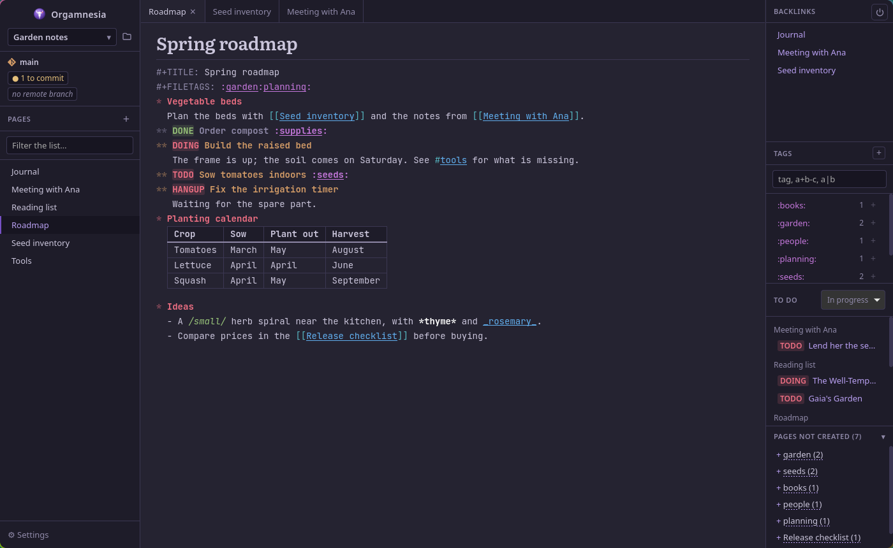

* Contents                                                         :noexport:
- [[*Projects and pages][Projects and pages]]
- [[*Editor][Editor]]
- [[*Links and tags][Links and tags]]
- [[*TODO states][TODO states]]
- [[*Tables][Tables]]
- [[*Images][Images]]
- [[*Window][Window]]
- [[*Side panel][Side panel]]
- [[*Trash][Trash]]
- [[*Keyboard shortcuts][Keyboard shortcuts]]
- [[*Extensions][Extensions]]
- [[*Settings][Settings]]
- [[*Files][Files]]

* Projects and pages

** Project
A project is a folder of =.org= pages linked to each other.

- If the folder has a =pages/= subfolder, the pages are there; otherwise, if the
  folder already holds =.org= files, it is used as is. An empty folder gets
  =pages/= and =assets/=.
- The project name, above the list of pages, opens the projects menu: open another
  folder, go back to a recent project, remove a project from the list (the folder
  itself is left untouched).
- Switching projects with unsaved tabs asks for confirmation.
- With no project open, the welcome screen offers to open one and lists the
  recent projects.

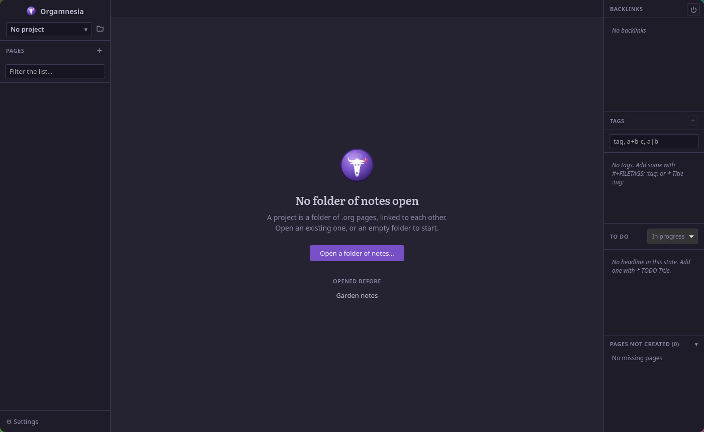

** Pages
- *Create*: the =+= button of the list of pages, the "New page" shortcut, or a right
  click in the list. A new page starts with its title (=* Name=).
- *Open*: click in the list, quick open, or Ctrl+click on a link.
- *Filter*: the "Filter the list…" field above the list of pages keeps the pages
  whose name contains the text typed (ignoring case and accents).
- *Rename*: right click on the page (list or tab), double click on the tab, or right
  click on the page title. Links to the page in the other pages are rewritten
  (can be turned off).
- *Delete*: right click on the page (list or tab), last in the menu. The page goes
  to the project's [[*Trash][trash]].

** Quick open
The "Quick open" shortcut (Ctrl+K in Classic, Ctrl+X B or Alt+X in Emacs) opens a
field that searches, ignoring case and accents:
- the open tabs;
- the pages of the project;
- the tags (picking one shows it in the tags frame);
- and offers to create the page when the name typed doesn't exist.

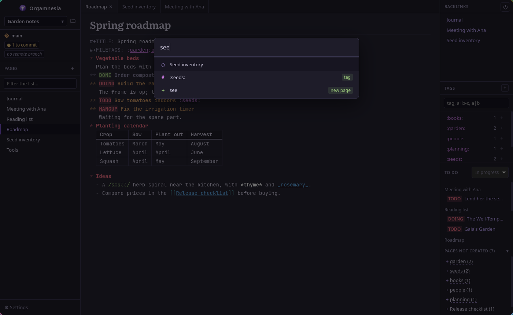

** Saving and outside changes
- Pages are saved on every keystroke (can be turned off); otherwise use the
  "Save" shortcut. An unsaved tab is marked.
- Pages changed or deleted by another program (sync tool, git, another editor)
  are reloaded. A tab with unsaved changes is not overwritten: a message says so.
- Quitting with unsaved pages asks for confirmation.

** Cleanup on quit
Two settings (off by default) delete on quit:
- empty pages (nothing but spaces, tabs, line breaks or =*=);
- pages holding only their title (=* Name=), like a page created and never filled.

These pages are deleted for good, without going through the trash.

** Session
On start, the tabs and panes open when the app was quit are opened again (can be
turned off).

* Editor

** Org-mode highlighting
- Headlines =*=, =**=… coloured by level, stars dimmed.
- =*bold*=, =/italic/=, =_underline_=, =+strikethrough+= (not inside a word: =1+2+3=
  stays as is).
- Links =[[page]]= and =[[page][text]]=, =#keywords=, =:tags:=.
- =#+TITLE:= and =#+FILETAGS:=: the keyword dimmed, the value highlighted.
- Tables, their header rows in bold.
- TODO keywords (see [[*TODO states][TODO states]]).

** Page title
Above the editor, in large type: the page's =#+TITLE:= if it has one, else its name.
Right click on it: rename the file, add or edit the =#+TITLE:=. Can be hidden in the
settings.

** Folding headlines
Tab on a headline folds and unfolds it as org-mode does:
1. folded (everything under it hidden);
2. only its sub-headlines, folded;
3. everything shown.

A folded headline ends with =…=. With nothing under it, a message says so.
Backspace or Delete next to the =…= unfolds the headline instead of deleting the
hidden text. Can be turned off (Tab then does what it does elsewhere).

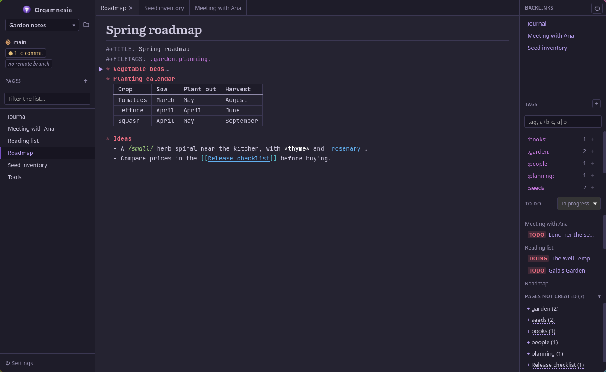

** Indentation under headlines
The text under a headline is shifted to the column of the headline's text, like
Emacs' =org-indent-mode=. This is on screen only: the file holds no such spaces.
Can be turned off.

** Headline stars
Optional: only the last star of a headline shows, like Emacs'
=org-hide-leading-stars=; the level reads as an indent.

** Broken links
A link that leads nowhere (a page that doesn't exist, a missing file or image) is
drawn in red, with a ❌ in the margin of its line. On screen only: nothing is written
to the file. Can be turned off.

** Line numbers
Optional, in the margin. They follow the lines of the file, even when a table is
drawn or a headline folded.

** Completion
While typing, a list offers:
- page names after =[[= (accepting closes the link with =]]=);
- page names after =#=;
- existing tags in the tags of a headline (=* Title :pro=), in =#+FILETAGS:= or after
  =:= in the text (accepting adds the closing =:=).

Up and down arrows (or Ctrl+N / Ctrl+P) to choose, Enter or Tab to accept, Escape
(or Ctrl+G) to close. Matching ignores case and accents.

** Pairs and electric mode
- Typing =(=, =[=, ={= or ="= also inserts the closing character.
- Electric mode (on by default): typing =( ) [ ] { } " '= on selected text wraps it in
  the pair.

** Emphasis
Bold, italic, underline and strikethrough by shortcut: on a selection, wraps it in
the markers (or removes them when already there); without a selection, inserts a
pair of markers with the cursor between them.

** New headline
The "New heading" shortcut (Shift+Enter; also Alt+Enter in Emacs) inserts, below
the current line, a headline of the same level as the current one.

** Headline level
On a headline, Alt+Shift+→ moves it one level down and Alt+Shift+← one level up,
together with its sub-headlines, as Emacs' =M-S-<right>= / =M-S-<left>= do
(=org-demote-subtree= / =org-promote-subtree=). A first-level headline doesn't go up.

** Find and replace
- Find in the page: Enter for the next match, Shift+Enter for the previous one,
  Escape to close.
- Replace shows with its own shortcut or the button of the bar: "Replace" (the
  current match) or "All".
- By default, finding ignores case and accents ("regle" finds "Règle"); a button,
  or a setting, makes it exact.
- While finding, tables are shown as text.

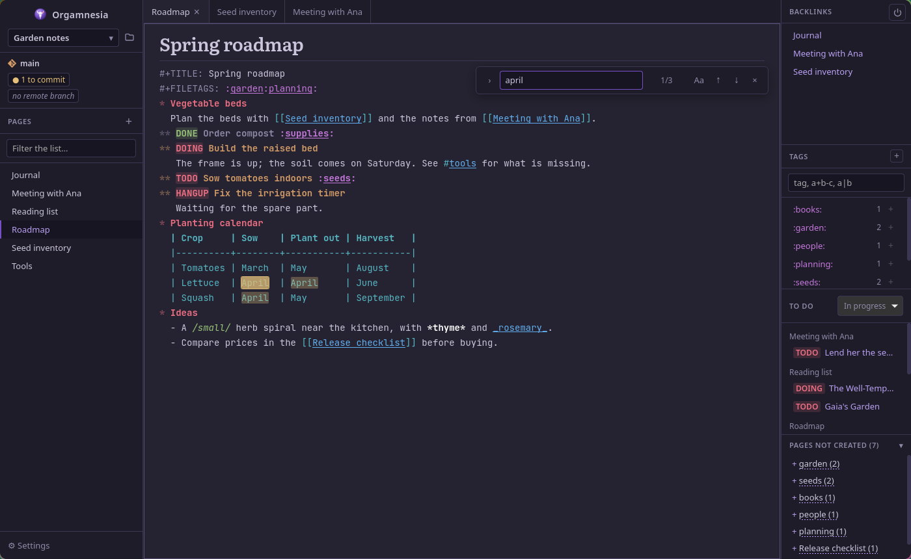

** Emacs commands
With the Emacs profile: movements (character, word, line, sentence, paragraph,
headline, start and end of document, page), kill to end of line, kill a word, kill
ring (kill then yank with Ctrl+Y), selection mark.

*** Selection mark
Ctrl+Space sets a mark: the selection then follows the cursor, like Emacs' region.
Ctrl+Space twice at the same place, or Ctrl+G, cancels it. Killing or copying the
region (Ctrl+W, Alt+W) ends it. Can be turned off.

*** Multi-key shortcuts
Shortcuts can chain several keys (=Ctrl+X Ctrl+S=). The keys typed so far show in
the status bar; Escape cancels, and the sequence is dropped after 4 seconds. Ctrl
can be kept down for the second key (=Ctrl+X Ctrl+O= works as =Ctrl+X O=).

* Links and tags

** Links between pages
- =[[Page]]= or =[[Page][text shown]]=: link to a page.
- =#keyword=: link to the page of that name (can be turned off). Dashes are allowed
  by default (=#my-tag=); unchecked, =#my-tag= is read as =#my=, as org-mode does.
- Ctrl+click, or the "Open link" shortcut (Ctrl+Enter in Classic, Ctrl+C Ctrl+O in
  Emacs), opens the page of the link under the cursor and creates it if needed.
- By default, links ignore case and accents: =[[élody]]= leads to =Elody=.

** Org-mode tags
- =#+FILETAGS: :a:b:= tags the whole page; =* Title :a:b:= tags a headline (its
  sub-headlines inherit them in the tag search).
- =:example:= in the text is read as a tag too.
- Tags are links to the page of the same name (can be turned off).
- Letters, digits, =_ @ # %= only, as in org-mode; dashes are optional.

** Tag search
In the tags frame, with the org-mode syntax:
- =a+b=: a and b; =a-b=: a without b; =a|b=: a or b;
- with dashes allowed in tags, write =a -b= to exclude b.

Case matters. The results are the pages (by =#+FILETAGS:=) and the headlines that
match; a click opens the page at the right line. The field completes tag names.

* TODO states
As in org-mode, a keyword after the stars of a headline gives its state.

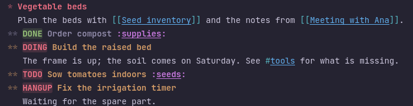

- *Change the state*: on a headline line, wherever the cursor is, "Next TODO state" /
  "Previous TODO state" go through (none) → TODO → DOING → HANGUP → DONE → (none).
  Default shortcuts: Shift+→ and Shift+← in the Emacs profile, none in the Classic
  profile (set them in the settings). Off a headline, the shortcut does what it
  usually does (Shift+arrows select).
- *Display*: states in progress in red, done states in green; a done headline is
  dimmed.
- *List of states*: in the settings, in the Emacs format =TODO DOING HANGUP | DONE=.
  The states after the =|= are the done ones; without =|=, only the last one is.
  Emacs suffixes (=TODO(t)=, =DONE(d!)=) are accepted and ignored.
- *Per page*: a =#+TODO:= line (or =#+SEQ_TODO:=, =#+TYP_TODO:=) gives the page its own
  states. Several lines make several sequences: the cycle stays in the sequence of
  the current keyword.
- *Overview*: the "To do" frame of the side panel.
- The whole feature can be turned off in the settings.

* Tables
- An org table (=| a | b |=) is drawn as a real table while the cursor is not in it;
  it turns back into text to be edited.
- Tab and Shift+Tab move to the next or previous cell and align the table again, as
  org-mode does. Tab after the last cell adds a row.
- =|-= then Tab draws the separator line; the rows above the first separator are the
  header.

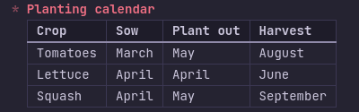

* Images
- A line holding only a link to an image (=[[../assets/photo.png]]=, maybe after the
  stars of a headline or a list dash) is drawn as the image while the cursor is not
  on it; it turns back into text to be edited.
- The button at the bottom right of the editor, or dropping a file on the page,
  copies the image into the project's =assets/= folder, named as Logseq names them
  (=photo_1759520598218_0.png=), and adds its link on a line of its own.
- The bottom right corner of an image resizes it with the mouse. The size is written
  in the org-mode format (=#+ATTR_ORG: :width 300= on the line above, the default) or
  the Logseq one (={:height 200, :width 300}= after the link). Both are read; Logseq
  adds one at each resize, the last one counts.
- Can be turned off: the links then stay text.

* Window

** Tabs
Each pane has its own tabs. Click to activate, double click to rename the page,
right click to rename or delete, =×= to close.

** Two panes
Like Emacs windows: split the editor side by side or one above the other, move to
the other pane, close the current pane or keep only it. A page must be open to
split.

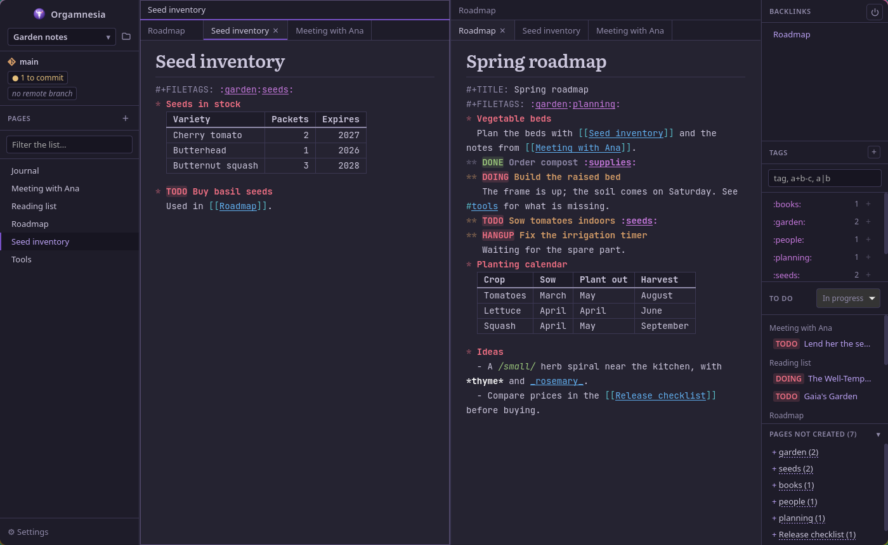

** Page history
"Back to previous page" and "Forward to next page" (Alt+← and Alt+→) go through the
pages shown in the pane, like a web browser.

** Window regions
F6 and Shift+F6 move between the pages, the editor and the side panel. Lists can be
browsed with the keyboard.

** Empty editor
With no page open: a button to go to a page and the essential shortcuts.

** Status bar
At the bottom of the window: messages (page saved, error, keys of a shortcut being
typed…). After a deletion, it offers "Undo". =×= closes it.

* Side panel
Each frame can be hidden in Settings > Display; the panel goes away when all of them
are. Its width can be changed with the mouse.

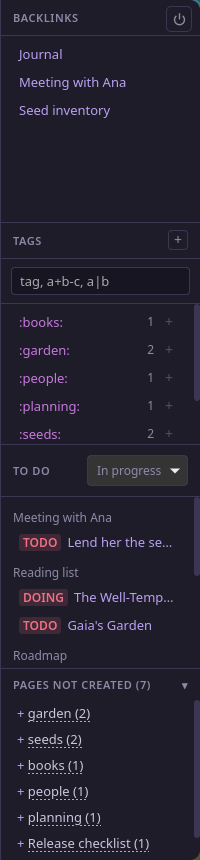

- *Backlinks*: the pages linking to the page shown.
- *Tags*: every tag of the project with its count, and the tag search. The =+= of the
  header adds a tag to the page shown (in =#+FILETAGS:=); the =+= of a tag in the list
  adds that one directly.
- *To do*: the TODO headlines of the whole project, by page. The filter shows the
  headlines in progress (default), done, all, or a single state. A click opens the
  page on the headline.
- *Pages not created*: links to pages that don't exist, most used first. Click:
  visits in turn the pages using the link; right click: create the page, or go to
  the link in a given page. The height of the frame can be changed with the mouse.

* Trash
- A deleted page goes to the project's =.trash/= folder, named =<time>-<page>.org=.
  The folder holds a =.gitignore= that keeps it out of git.
- Deleting asks for confirmation (red button, focus on Cancel: Enter doesn't
  delete).
- Right after, "Undo" in the status bar puts the page back and reopens it if it was
  open. If a page of the same name was created in the meantime, restoring is
  refused.
- Settings > Editing > Trash:
  - the number of pages in the trash and an "Empty the trash" button (for good,
    with confirmation);
  - "Empty the trash automatically" (off by default): when a project opens,
    deletes the pages kept longer than the chosen time (30 days by default), then
    the oldest ones while the trash is over the maximum size (10,000,000 bytes by
    default). 0 = no limit for that criterion.
- The age of a page comes from the time in its name. A file dropped there by hand
  without that prefix counts as just deleted.

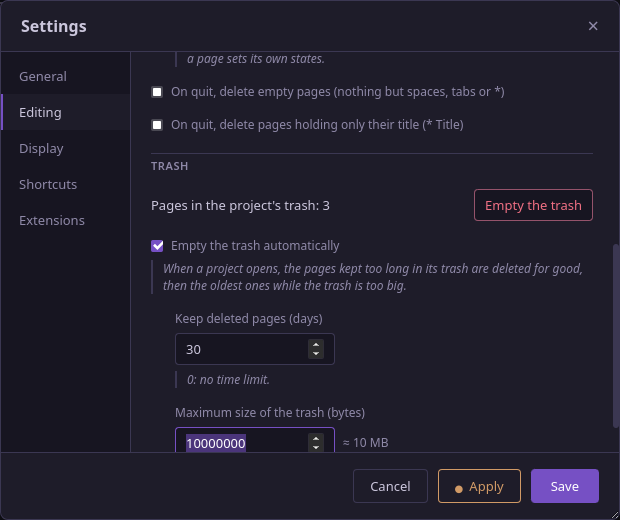

* Keyboard shortcuts

** Profiles
Two built-in profiles, *Classic* and *Emacs*, apply to the whole application.
Changing a shortcut creates a custom profile (which can be renamed, duplicated,
deleted). Each action takes two shortcuts. A conflict (the same keys for two
actions) is shown and prevents saving.

Built-in profiles get the new shortcuts of later versions automatically; a custom
profile gets those of the actions it didn't know.

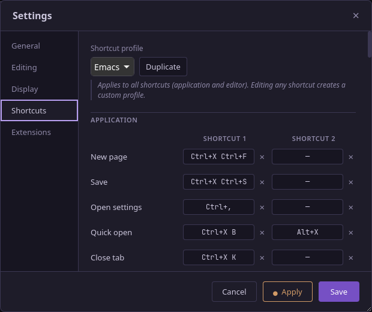

** Default shortcuts

*** Application
| Action                      | Classic          | Emacs                     |
|-----------------------------+------------------+---------------------------|
| New page                    | Ctrl+N           | Ctrl+X Ctrl+F             |
| Save                        | Ctrl+S           | Ctrl+X Ctrl+S             |
| Open settings               | Ctrl+,           | Ctrl+,                    |
| Quick open                  | Ctrl+K           | Ctrl+X B, Alt+X           |
| Close tab                   | Ctrl+W           | Ctrl+X K                  |
| Next / previous tab         | Ctrl+Tab / +Shift | Ctrl+X → / Ctrl+X ←      |
| Previous / next page        | Alt+← / Alt+→    | Alt+← / Alt+→             |
| Split side by side          | Ctrl+Alt+V       | Ctrl+X 3                  |
| Split top / bottom          | Ctrl+Alt+H       | Ctrl+X 2                  |
| Close pane                  | Ctrl+Alt+W       | Ctrl+X 0                  |
| Keep only this pane         | Ctrl+Alt+O       | Ctrl+X 1                  |
| Other pane                  | Ctrl+O           | Ctrl+X O, Ctrl+O          |
| Next / previous region      | F6 / Shift+F6    | F6 / Shift+F6             |
| Quit                        | Ctrl+Q           | Ctrl+X Ctrl+C             |

*** Editor
| Action                         | Classic             | Emacs                         |
|--------------------------------+---------------------+-------------------------------|
| Copy / cut / paste             | Ctrl+C / X / V      | Alt+W / Ctrl+W / Ctrl+Y       |
| Select all                     | Ctrl+A              | —                             |
| Undo / redo                    | Ctrl+Z / Ctrl+Y     | Ctrl+/, Ctrl+X U / —          |
| New heading                    | Shift+Enter         | Alt+Enter, Shift+Enter        |
| Open link                      | Ctrl+Enter          | Ctrl+C Ctrl+O                 |
| Find / previous                | Ctrl+F, F3 / Shift+F3 | Ctrl+S / Ctrl+R             |
| Replace                        | Ctrl+H              | Alt+%                         |
| Next / previous cell           | Tab / Shift+Tab     | Tab / Shift+Tab               |
| Bold                           | Ctrl+B              | Ctrl+C Ctrl+X Ctrl+F *        |
| Italic                         | Ctrl+I              | Ctrl+C Ctrl+X Ctrl+F /        |
| Underline                      | Ctrl+U              | Ctrl+C Ctrl+X Ctrl+F _        |
| Strikethrough                  | Ctrl+Shift+X        | Ctrl+C Ctrl+X Ctrl+F +        |
| Next / previous TODO state     | —                   | Shift+→ / Shift+←             |
| Headline level down / up       | Alt+Shift+→ / ←     | Alt+Shift+→ / ←               |
| Set mark / cancel              | —                   | Ctrl+Space / Ctrl+G           |
| Start / end of line            | —                   | Ctrl+A / Ctrl+E               |
| Next / previous character      | —                   | Ctrl+F / Ctrl+B               |
| Next / previous line           | —                   | Ctrl+N / Ctrl+P               |
| Next / previous word           | —                   | Alt+F / Alt+B                 |
| Sentence: end / start          | —                   | Alt+E / Alt+A                 |
| Paragraph: end / start         | —                   | Alt+} / Alt+{ (Ctrl+↓ / ↑)    |
| First non-blank character      | —                   | Alt+M                         |
| Next / previous headline       | —                   | Ctrl+C Ctrl+N / Ctrl+C Ctrl+P |
| Start / end of document        | —                   | Alt+< / Alt+>                 |
| Page down / up                 | —                   | Ctrl+V / Alt+V                |
| Kill to end of line            | —                   | Ctrl+K                        |
| Kill next / previous word      | —                   | Alt+D / Alt+Backspace         |
| Delete next character          | —                   | Ctrl+D                        |

In Classic, movement and selection stay those of the system (arrows, Home, End,
Shift+arrows…). In a profile, the browser's editing shortcuts that are not assigned
(for example Ctrl+C in Emacs) do nothing.

* Extensions

** Git
Under the project name: its branch and what is left to commit, push or pull ("Up to
date", "no remote branch", "detached"…). Needs git; commits to pull are counted
since the last =git fetch= (no automatic fetch). The state is updated when the
repository changes. On by default.

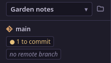

** Export with logseq-site-builder
Off by default. When on, an "Export" button runs =logseq-site-builder build <project>=
(the path of the program can be set) and says when it is done.

* Settings
The settings window (Ctrl+,) can be moved and resized. "Apply" saves the changes
without closing (a dot shows there are some), "Save" saves and closes, "Cancel"
closes without saving. The explanations under a setting are in italics.

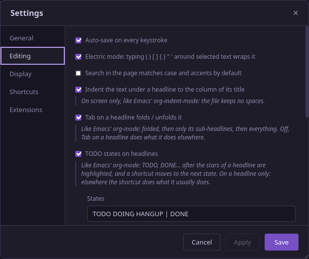

** General
- Default project folder.
- Reopen the pages and panes on start.
- Links ignore case and accents.
- =#keywords= as links, with or without dashes.
- =:tags:= as links, with or without dashes.
- Update links when a page is renamed.
- Language: French or English.

** Editing
- Auto-save.
- Electric mode.
- Exact find (case and accents) by default.
- Indent the text under headlines.
- Tab on a headline folds / unfolds it.
- TODO states on headlines, and the list of states.
- On quit, delete empty pages / pages holding only their title.
- Trash: empty it, empty it automatically, maximum time and size.

** Display
- Appearance: app name and logo, page title, quit button, line numbers,
  headline stars hidden but the last.
- Mark the broken links.
- Images: show them, and the format of their size (org-mode or Logseq).
- Frames: list of pages, backlinks, tags, pages not created, to do.

** Extensions
- logseq-site-builder and its path.
- Git.

** Shortcuts
Profile, shortcuts of the application, the panes, the editor, the selection mark
(with its setting) and the TODO states (with their setting).

* Files
- Pages stay plain =.org= files, readable and editable with Emacs or any other
  editor.
- Settings: =~/.config/com.orgamnesia.app/= (=settings.json=, =keybindings.json=).
- Trash: =<project>/.trash/=.
