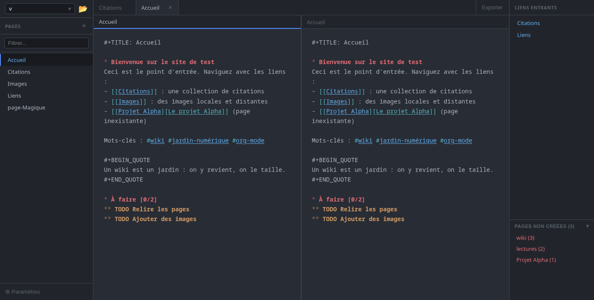

#+TITLE: Orgamnesia

Un wiki personnel en fichiers =org-mode=, avec des liens entre pages, des
liens entrants et des raccourcis clavier à la Emacs. Application de bureau
écrite en Rust : Tauri v2 (backend) et Leptos 0.7 (frontend, compilé en WebAssembly).

#+BEGIN_QUOTE
*Version bêta.* Le projet est en cours de développement : des bugs sont probables,
des fonctionnalités peuvent changer, et il vaut mieux garder une copie de ses fichiers =.org=.

*Code généré par IA.* Cette application a été codée avec l'aide de Claude (Anthropic),
une intelligence artificielle. Le code est à relire avec le même esprit critique
que n'importe quelle contribution.
#+END_QUOTE

/Éditeur coupé en deux (=C-x 3=), mots-clés =#tag= et liens =[[page]]= cliquables,
liens entrants à droite, « Pages non créées » en bas à droite./

* Fonctionnalités

** Projets
- Un projet est un dossier de fichiers =.org= (les pages sont dans =pages/=).
- Bouton « ouvrir un dossier » et sélecteur pour passer d'un projet à l'autre.
- Un projet par défaut réglable dans les préférences.

** Pages et liens
- Liens =[[Page]]= et =[[Page][texte affiché]]=. Ctrl+clic (ou /Suivre le lien/) ouvre la page, et la crée si elle n'existe pas.
- *Mots-clés* : =#idée= est un lien vers la page =idée= (option, activée par défaut).
  Ne sont pas des mots-clés : =#+TITLE=, =# commentaire= et =a#b=.
- *Liens entrants* : panneau de droite listant les pages qui pointent vers la page ouverte.
- *Pages non créées* : liens qui ne mènent à rien, triés par nombre d'appels
  (=cible (3)=). Clic : aller là où le lien est utilisé. Clic droit : créer la page ou aller au lien.
- Liens insensibles à la casse (option, activée par défaut).
- Barre latérale : clic droit pour /renommer/ ou /supprimer/ (le fichier est effacé).
- Renommer une page réécrit tous les liens qui y pointent, =[[…]]= comme =#…= (option, activée par défaut).

** Édition
- Coloration org-mode : titres, =TODO=/=DONE=, gras, italique, citations, tableaux, liens.
- Sauvegarde automatique à chaque frappe (option, activée par défaut).
- Mode « électrique » : avec du texte sélectionné, taper =( ) [ ] " '= l'entoure.
- Marqueur de sélection à la Emacs (=C-SPC=).
- Éditeur coupé en deux, façon fenêtres Emacs (voir plus bas).

** Interface
- Largeur de la barre latérale et du panneau de droite réglables en glissant leur bordure ;
  hauteur du bloc « Pages non créées » réglable aussi. Les tailles sont mémorisées.
- Fenêtre des préférences redimensionnable, sa taille est mémorisée.
- Français et anglais.

* Raccourcis clavier

Tout est configurable dans *Paramètres → Raccourcis*.

- Deux jeux prédéfinis : *Classique* et *Emacs*.
- Dès qu'on modifie un raccourci, un profil *Personnalisé* est créé ; on peut en avoir
  plusieurs et les renommer. Tous les profils ont les mêmes champs (certains restent vides).
- Suites de touches (=C-x C-s=), avec Ctrl, Maj, Alt.
- Deux actions ne peuvent pas partager la même combinaison : un conflit s'affiche en rouge,
  avec une alerte, et empêche d'enregistrer.
- Bouton *Appliquer* (sans fermer la fenêtre), grisé quand il n'y a rien à appliquer.

** Profil Emacs (principaux raccourcis)

| Action                         | Raccourci               |
|--------------------------------+-------------------------|
| Enregistrer                    | =C-x C-s=               |
| Nouvelle page                  | =C-x C-f=               |
| Changer de page / fermer       | =C-x b= / =C-x k=       |
| Suivre le lien                 | =C-c C-o=               |
| Caractère, ligne               | =C-f C-b C-n C-p=       |
| Mot                            | =M-f M-b=               |
| Début / fin de ligne           | =C-a= / =C-e=           |
| Début / fin du document        | =M-<= / =M->=           |
| Phrase                         | =M-a= / =M-e=           |
| Paragraphe                     | =M-{= / =M-}=           |
| Titre précédent / suivant      | =C-c C-p= / =C-c C-n=   |
| Défiler                        | =C-v= / =M-v=           |
| Marqueur, couper, copier, coller | =C-SPC=, =C-w=, =M-w=, =C-y= |
| Couper le reste de la ligne    | =C-k=                   |
| Annuler                        | =C-/=                   |

** Fenêtres (split)

| Action                    | Emacs       | Classique  |
|---------------------------+-------------+------------|
| Split vertical            | =C-x 3=     | =C-M-v=    |
| Split horizontal          | =C-x 2=     | =C-M-h=    |
| Fermer ce volet           | =C-x 0=     | =C-M-w=    |
| Garder ce seul volet      | =C-x 1=     | =C-M-o=    |
| Passer à l'autre volet    | =C-x o=, =C-o= | =C-o=, =F6= |

En split vertical, chaque volet a son bandeau avec le nom de sa page.

* Installation et lancement

Prérequis : Rust (avec la cible =wasm32-unknown-unknown=), [[https://trunkrs.dev][Trunk]],
=cargo-tauri= et les dépendances système de Tauri v2 (WebKitGTK sous Linux).

#+BEGIN_SRC sh
rustup target add wasm32-unknown-unknown
cargo install trunk tauri-cli --locked

cargo tauri dev      # développement, rechargement à chaud
cargo tauri build    # paquet de l'application
#+END_SRC

Tests :

#+BEGIN_SRC sh
cargo test --lib           # frontend (fonctions pures)
cd src-tauri && cargo test # backend (parseur, index des liens, réglages)
#+END_SRC

* Organisation du code

| Chemin                    | Rôle                                                       |
|---------------------------+------------------------------------------------------------|
| =src/=                    | Frontend Leptos : =app.rs=, =state.rs=, =components/=       |
| =src/keybindings.rs=      | Profils, suites de touches, résolution des raccourcis       |
| =src/motion.rs=           | Déplacements à la Emacs et recherche de liens (fonctions pures) |
| =src/highlight.rs=        | Coloration syntaxique de l'éditeur                          |
| =src-tauri/src/commands/= | Commandes Tauri : projets, fichiers, renommage, liens       |
| =src-tauri/src/parser/=   | Parseur org-mode, extraction et réécriture des liens        |
| =src-tauri/src/index/=    | Index des liens entrants                                    |
| =public/css/app.css=      | Styles                                                      |

Les réglages sont dans =~/.config/com.orgamnesia.app/= (=settings.json=, =keybindings.json=).
Les tailles des panneaux sont gardées dans le =localStorage= de la fenêtre.
